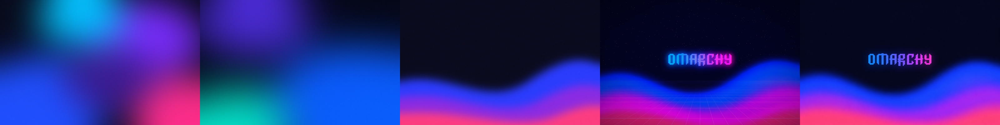
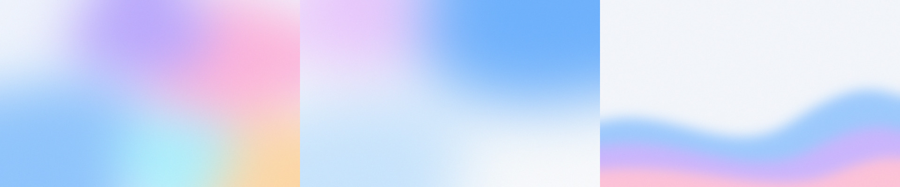

# Liquid Glass for Omarchy

A macOS / iOS-inspired "liquid glass" theme for [Omarchy](https://omarchy.org), in **dark** and **light**.

- Rounded squircle windows with a thin light glass rim and soft shadows
- Frosted blur behind windows, the bar, menus, notifications and the OSD
- Translucent terminal backgrounds with crisp text (foot, Alacritty, kitty, Ghostty)
- Springy, iOS-like window and workspace animations
- Apple system color palette (accessible high-contrast variants in light mode)
- Original gradient wallpapers for both variants, plus a synthwave Omarchy wallpaper in dark




## Install

```bash
git clone https://github.com/vsvito420/omarchy-liquid-glass.git
cd omarchy-liquid-glass
./install.sh
omarchy theme set "Liquid Glass Dark"   # or "Liquid Glass Light"
```

> **Why not `omarchy theme install <url>`?** For safety, Omarchy strips `hyprland.lua`
> and terminal configs from themes installed as git clones. That is exactly where the
> blur, rounding and transparency live, so `install.sh` copies the themes instead.
> Read the files before installing — `hyprland.lua` is executed by Hyprland.

Open a new terminal window after applying to see the translucent background.

## Tweaking

| What | Where |
| --- | --- |
| Blur, rounding, shadows, window opacity, animations | `themes/<variant>/hyprland.lua` |
| Bar / menu / notification translucency (`background-alpha`) | `themes/<variant>/shell.toml` |
| Terminal transparency | `alpha` in `foot.ini`, `opacity` in `alacritty.toml`, etc. |
| Colors | `themes/<variant>/colors.toml` |

`tools/glass-finish.sh` regenerates the terminal and shell files from Omarchy's templates
for the currently applied variant, e.g. `tools/glass-finish.sh dark 0.72 0.35 0.55 "#ffffff"`
(variant, terminal alpha, bar alpha, card alpha, rim color).

## Notes

This is frosted glass — Hyprland can't do real refraction / lens distortion.
Not affiliated with Apple. Wallpapers are generated with ImageMagick and are free to use.

## License

MIT
