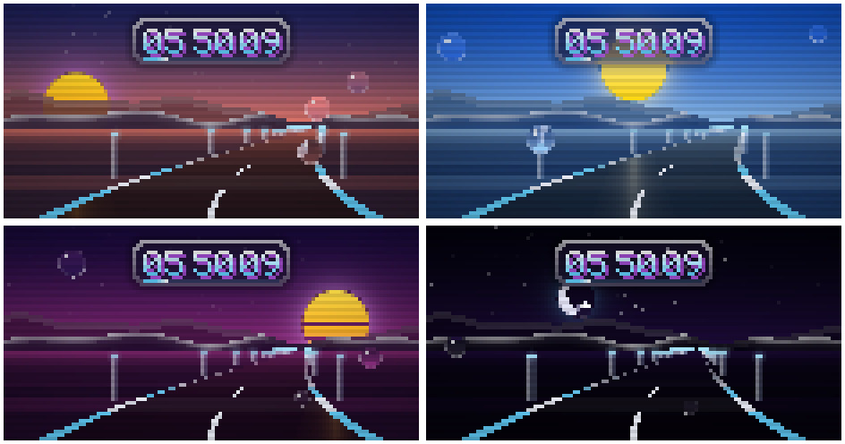

# Liquid Glass for Omarchy

A macOS / iOS-inspired "liquid glass" theme for [Omarchy](https://omarchy.org), in **dark**, **light** and **warm** (a soft sepia light variant that is easy on the eyes).

- Rounded squircle windows with a thin light glass rim and soft shadows
- Frosted blur behind windows, the bar, menus, notifications and the OSD
- Translucent terminal backgrounds with crisp text (foot, Alacritty, kitty, Ghostty)
- Springy, iOS-like window and workspace animations
- Apple system color palette (accessible high-contrast variants in light mode)
- Warm variant: parchment background, brown text, terracotta accent and earthy terminal colors
- Matching Chromium / Chrome color: black toolbar in dark, frosted blue-grey in light, parchment in warm
- Optional browser extension that turns white web pages sepia while the warm variant is active
- Original gradient wallpapers for both variants, plus a synthwave Omarchy wallpaper in dark
- Optional screensaver: a drive through a glass landscape under a live 24h sky


## Install

```bash
git clone https://github.com/vsvito420/omarchy-liquid-glass.git
cd omarchy-liquid-glass
./install.sh
omarchy theme set "Liquid Glass Dark"   # or "Liquid Glass Light" / "Liquid Glass Warm"
```

> **Why not `omarchy theme install <url>`?** For safety, Omarchy strips `hyprland.lua`
> and terminal configs from themes installed as git clones. That is exactly where the
> blur, rounding and transparency live, so `install.sh` copies the themes instead.
> Read the files before installing — `hyprland.lua` is executed by Hyprland.

Open a new terminal window after applying to see the translucent background.

## Screensaver

A night drive through a glass landscape: a wet glass road curving toward the horizon,
frosted-glass mountains sliding past in parallax, glowing glass posts along the roadside,
raindrops running down the windshield, and a chunky pixel clock with seconds and a
sweeping seconds bar on a frosted glass card in the sky, finished with soft CRT scanlines.

The sky follows the real time of day — sunrise, blue noon, synthwave sunset, then
moon and stars at night. Accent colors come from the active theme; the light variant
gets a pastel take on the same day.



Install it separately (asks for sudo once, for the shim):

```bash
./screensaver/install.sh           # install / update
./screensaver/install.sh --remove  # back to Omarchy's stock screensaver
```

### Styles

Pick one in `~/.config/liquid-glass/screensaver.toml` (created on install, kept on updates):

| `style` | What it shows |
| --- | --- |
| `retro` (default) | Stylised synthwave day that follows the clock |
| `sun` | The real sun and moon for your location and date: position, moon phase, and the matching light — night, blue hour, golden hour, daylight. The date line adds sunrise, sunset and the sun's elevation. |

`sun` needs your `latitude` and `longitude` in that file and falls back to `retro`
without them. The location stays in your local config; nothing is looked up online.
Sun position uses NOAA's short approximation, accurate to a fraction of a degree.

It runs only while a `liquid-glass-*` theme is applied; with any other theme Omarchy's
stock screensaver runs as usual. `omarchy toggle screensaver` and the idle timeouts in
`~/.config/omarchy/shell.json` keep working unchanged.

How it hooks in: Omarchy's screensaver draws with `ttfx`, and `/usr/local/bin` comes
before `/usr/bin` on `PATH`. `screensaver/ttfx` is a small shim installed there that
starts `~/.local/bin/liquid-glass-screensaver` for the screensaver's random effect and
passes every other `ttfx` call straight through to `/usr/bin/ttfx`. Nothing in
`/usr/share/omarchy` is touched.

```bash
omarchy launch screensaver force                   # try it now
LG_SPEED=1 ~/.local/bin/liquid-glass-screensaver   # whole day as a timelapse, 1 h/s
LG_HOUR=19 ~/.local/bin/liquid-glass-screensaver   # pin the sky to 19:00
LG_STYLE=sun LG_DATE=2026-12-21 liquid-glass-screensaver   # try a style / date
```

Plain Python 3.11+, no extra packages. Runs in foot, Alacritty, kitty and Ghostty.
Light on resources: the sky is rendered once per second, overlays only touch their own
area, and only changed terminal cells are sent — about 13 % of one core and ~230 KB/s
to the terminal fullscreen at 20 fps.

## Sepia web pages (Chromium / Chrome)

`sepia-web/` is a small extension that replaces white and near-white page backgrounds
with the warm variant's background color, keeping light-grey shades as slightly darker
sepia. Images, videos, gradients and dark sites are left alone. It only acts while
**Liquid Glass Warm** is applied; with any other theme pages look normal.

```bash
./sepia-web/install.sh   # registers the native messaging host for Chromium / Chrome
```

Then open `chrome://extensions`, enable **Developer mode**, click **Load unpacked** and
pick `sepia-web/extension`.

Extensions can't read files, so a tiny native messaging host (`sepia-web/host/sepia-host.py`,
plain Python, no packages) reports the active theme name and its background color from
`~/.local/state/omarchy/current/`. No sudo, no browser policies. After a theme change the
extension picks it up as soon as you switch tabs or focus the browser, otherwise within 30 s.
Add more theme names to `SEPIA_THEMES` in `sepia-web/extension/background.js`.

## Tweaking

| What | Where |
| --- | --- |
| Blur, rounding, shadows, window opacity, animations | `themes/<variant>/hyprland.lua` |
| Bar / menu / notification translucency (`background-alpha`) | `themes/<variant>/shell.toml` |
| Terminal transparency | `alpha` in `foot.ini`, `opacity` in `alacritty.toml`, etc. |
| Colors | `themes/<variant>/colors.toml` |

`tools/glass-finish.sh` regenerates the terminal and shell files from Omarchy's templates
for the currently applied variant, e.g. `tools/glass-finish.sh dark 0.72 0.35 0.55 "#ffffff"`
(variant, terminal alpha, bar alpha, card alpha, rim color).

## Notes

This is frosted glass — Hyprland can't do real refraction / lens distortion.
Not affiliated with Apple. Wallpapers are generated with ImageMagick and are free to use.

## License

MIT
